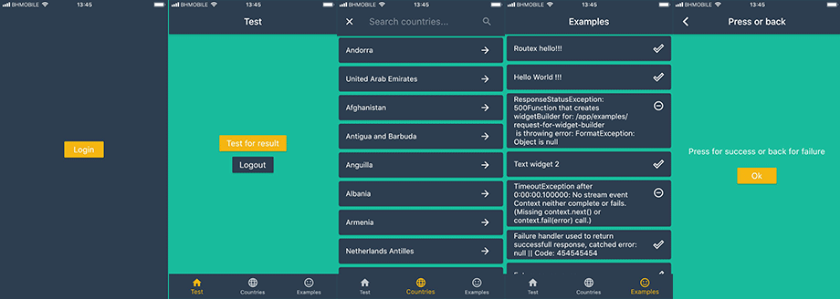

Example app has built in parallel with framework, and it has over 20+ examples, designed to show framework capabilities, composition, error handling, and RoutexNavigator - Routex consumer ready to use in your app.  

Each snippet in this document comes from example app:  

  

Try to notice relation between screens and code in example.dart file:  
```dart
class AppWidget extends StatelessWidget {
  @override
  Widget build(BuildContext context) {
    //To support hot reload in development, use RoutexNavigator.newInstance() to ensure new instance on each reload
    //otherwise just use RoutexNavigator.shared and instance will be automatically created.
    bindRouter(RoutexNavigator.newInstance().router);

    return MaterialApp(
      debugShowCheckedModeBanner: false,
      theme: AppTheme.instance,
      home: RoutexNavigator.shared.get("/app/main")(context),
    );
  }
}

void main() {
  runApp(AppWidget());
}

void bindRouter(Router router) {

  router.route("/*").handler(AppComponentHandler()); //basic app dependencies, available on app level

  router
    .route("/app/*") //each route that starts with /app/ requires authenthicated user, and user component for di
    .handler(AuthHandler(redirectTo: "/public/login")) //redirects to /public/login if user isn't presented.
    .handler((context) => context.put("sync_handler_between_two_asyncs", "Hello ${context.get<User>(User.key).name} :)").next())
    .handler(UserComponentHandler()); //creates user component

  router.route("/public/login").handler((context) =>
    context.response().end((_) => LoginScreen(context.get<AppComponent>(AppComponent.key).setUser)));

  router
    .route("/app/main")
  //.handler((context) => throw "Exceptions are propagated to failureHandlers or left to global error handlers.")
    .handler(mainScreen)
    .failureHandler((context) => context.response().end((_) =>
      Text("if some exception happens you can" +
          " continue contex with any number of failure handlers, you can show error screen or simply omit failureHandlers and propagate error to global error handlers.")));

  var testController = TestController();
  testController.bindRouter(router);

  var countriesController = CountriesController();
  countriesController.bindRouter(router);

  var examplesController = ExamplesController();
  examplesController.bindRouter(router);

  //Controller is just convinient way to group related routes and handlers, it doesn't have any other purpose
  //    abstract class Controller {
  //    void bindRouter(Router router);
  //    }
}

//equivalent of .handler((context) => context.response().end((_) => MainScreen()))
WidgetBuilder mainScreen(RoutingContext context) => (_) => MainScreen();
``` 
Main app content:  
* Test tab shows how to start another screen for result using handler and ability to log out.  
* Countries tab gives you idea how to integrate Routex in your app with other code.  
* Examples tab shows usage of router directly with streams without RoutexNavigator (ExamplesController => ExamplesSource =>  ExamplesScreen)
